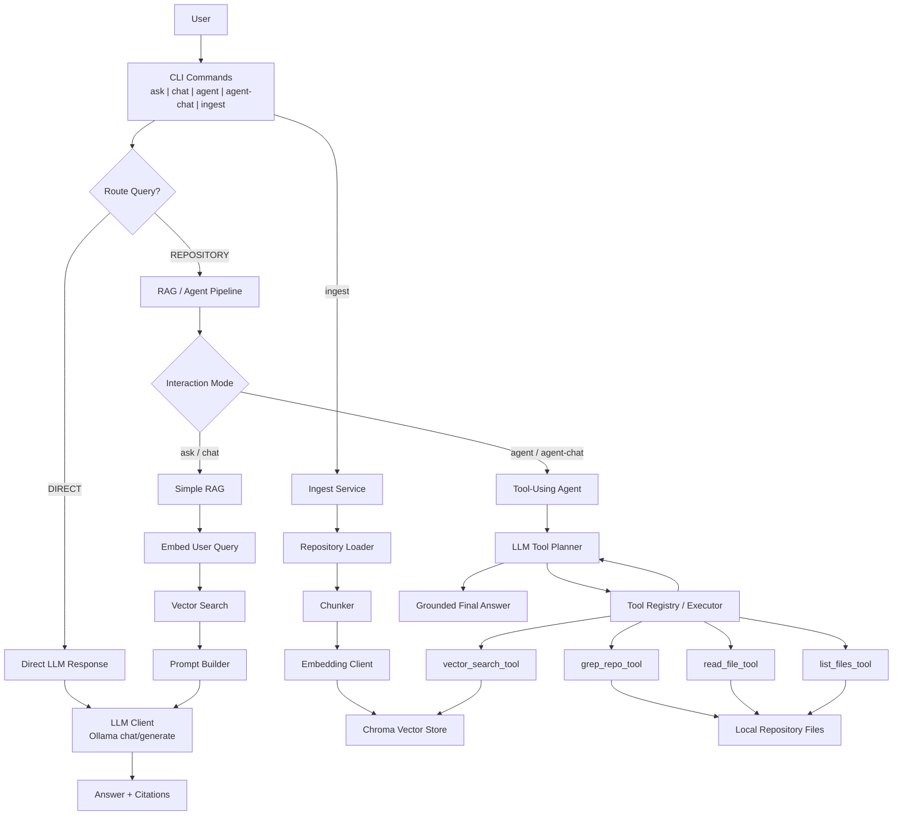

# Ask-Harry Architecture

## Notes

- `ingest` builds the searchable repository index.
- `ask` and `chat` use classic retrieval-augmented generation.
- `agent` and `agent-chat` let the LLM choose tools iteratively before answering.
- Conversational inputs can bypass retrieval and go straight to the LLM.
